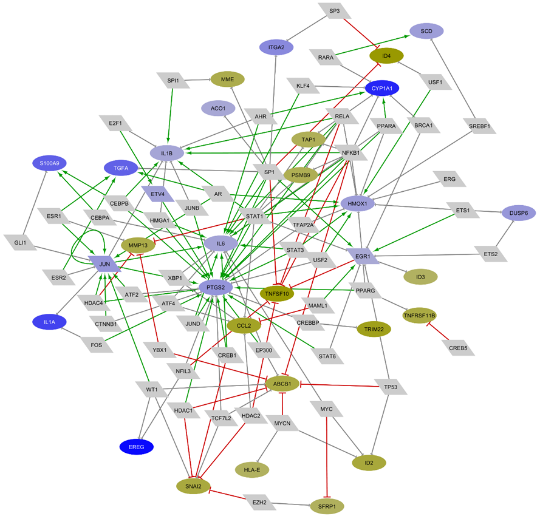

# Grupo: CVDS

## Integrantes do Subgrupo

- Keila Lívian Pereira Coelho - 176690
- Lucas Treviso Bandeira - 322979
- Mariana Dourado Ximenes de Sena Santos - 300643

---

## Informações do Artigo

- **Título:** Gene expression profiling of human bronchial epithelial cells exposed to fine particulate matter (PM2.5) from biomass combustion
- **Autores:** Popadić, D. et al.
- **Ano:** 2018
- **DOI:** https://doi.org/10.1016/j.taap.2018.03.024

---

## Resumo do artigo

O estudo de Popadić et al. [1] analisa como a exposição crônica de células epiteliais BEAS-2B ao material particulado fino (PM2.5) proveniente da combustão de biomassa altera o perfil de expressão gênica global. Foram identificados 175 genes diferencialmente expressos vinculados principalmente à inflamação, metabolismo de xenobióticos e estresse oxidativo. A principal contribuição do trabalho é a construção de uma rede de interação regulatória, não se limitando à análise de genes isolados. Ao integrar genes como **CYP1A1**, **EREG** e **GREM1** em uma rede regulatória construída a partir da base **TRRUST** [2] e visualizada via **Cytoscape** [3], os autores demonstraram que a exposição ao material particulado promove uma reconfiguração do controle transcricional celular.

No modelo de grafo apresentado (Fig. 1), os círculos representam genes alvo e retângulos identificam fatores de transcrição reguladores. As arestas descrevem as interações regulatórias, sendo as setas verdes para ativação, as vermelhas para repressão e as cinzas para interações não caracterizadas. Além disso, o modelo incorpora dados quantitativos de expressão por meio de cores, nos quais os nós azuis indicam genes ativados (*upregulated*) e os amarelos sinalizam genes reprimidos (*downregulated*). Essa representação permite visualizar não apenas quais genes serão afetados, mas como suas interações são reorganizadas no contexto da exposição ao material particulado.

### Modelo do grafo

**Figura 1.** Modelo de grafo utilizado no artigo. Fatores de transcrição (retângulos) e genes alvo (círculos) são conectados por interações de ativação (verde), repressão (vermelho) ou desconhecidas (cinza). A coloração dos nós indica expressão diferencial (azul: *upregulated*; amarelo: *downregulated*).

A estratégia do estudo consiste na identificação de *hubs* regulatórios para mapear a hierarquia da resposta ao poluente. A análise de centralidade revelou que o fator de transcrição **AhR** atua como um *hub* mestre, orquestrando a ativação dos genes mais impactados. Simultaneamente, a rede expôs comunidades de genes reprimidos ligadas ao fator **IRF-7**, evidenciando um comprometimento de vias relacionadas à resposta imune. Com essa metodologia, o estudo mostra que a toxicidade do PM2.5 envolve uma reorganização hierárquica da rede regulatória, aumentando a suscetibilidade a doenças pulmonares obstrutivas e fibróticas.

Essa abordagem se relaciona diretamente com o projeto desenvolvido pelo grupo, que investiga a toxicidade de micro e nanoplásticos (MNPs) em fibroblastos pulmonares humanos sob uma perspectiva sistêmica, considerando a exposição como uma perturbação capaz de reconfigurar redes de expressão gênica. O estudo de Popadić et al. [1] demonstra que abordagens baseadas em redes ajudam a compreender os efeitos de poluentes inaláveis. Nesse contexto, essa perspectiva será ampliada pelo projeto ao aplicar ferramentas de ciência de redes para investigar a toxicidade de MNPs.

---

## Referências

1. POPADIĆ, D. et al. *Gene expression profiling of human bronchial epithelial cells exposed to fine particulate matter (PM2.5) from biomass combustion*. Toxicology and Applied Pharmacology, v. 347, p. 10-22, 2018. https://doi.org/10.1016/j.taap.2018.03.024
2. HAN, H., SHIM, H., SHIN, D. et al. *TRRUST: a reference database of human transcriptional regulatory interactions*. Scientific Reports, 5, 11432, 2015. https://doi.org/10.1038/srep11432
3. SHANNON, P.; MARKIEL, A.; OZIER, O. et al. *Cytoscape: a software environment for integrated models of biomolecular interaction networks*. Genome Research, 13(11), 2498-2504, 2003. https://doi.org/10.1101/gr.1239303
