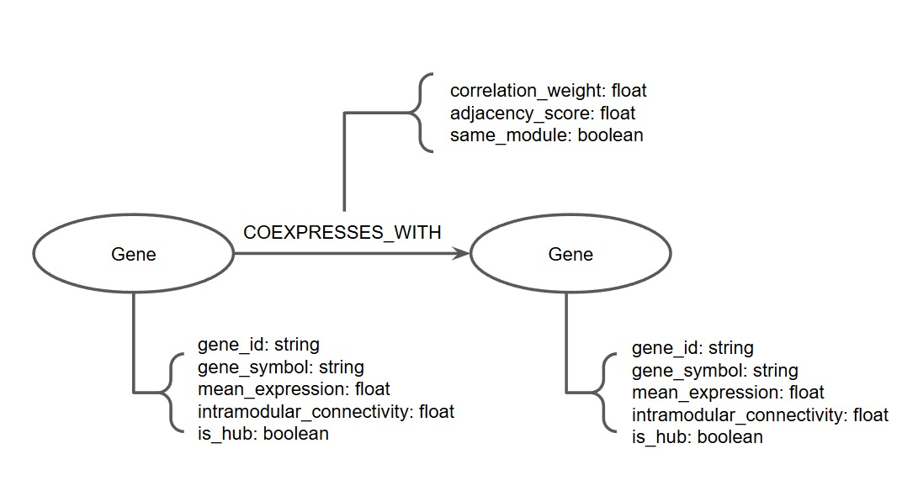

# Projeto Ciência de redes aplicada à toxicidade de microplásticos em pulmões humanos

# Project Network science applied to microplastic toxicity in human lungs

# Descrição Resumida do Projeto

Este projeto investiga a toxicidade respiratória de micro e nanoplásticos (MNPs), especificamente partículas de poliestireno, em fibroblastos pulmonares humanos (HPFs). Como o sistema respiratório distal carece de mecanismos eficientes de autolimpeza, a inalação torna-se uma via de exposição crítica, capaz de desencadear estresse celular e processos fibróticos. O estudo possui implicações profundas, pois adota uma abordagem sistêmica de ciência de redes para mapear como esses poluentes comprometem a robustez celular. Isso fornecerá uma compreensão estrutural sobre os mecanismos moleculares que impulsionam doenças respiratórias causadas pela exposição ao plástico.

A pergunta central da pesquisa busca entender como diferentes tamanhos de partículas de poliestireno (0,1 µm vs 1 µm) reconfiguram a topologia das redes de coexpressão gênica nestas células e quais genes centrais (hubs) controlam a transição para um estado de estresse celular. Trabalhando com a hipótese de que partículas menores afetam a função mitocondrial enquanto as maiores impactam a membrana e a homeostase proteica, o estudo aplicará metodologias avançadas (WGCNA e análise topológica) a dados de RNA-seq existentes. Essa abordagem permitirá identificar a hierarquia regulatória da resposta celular, avançando de forma original além da tradicional análise de genes isolados.

# Slides

- [Slides](assets/apresentacao.pdf)

# Fundamentação Teórica

A inalação de micro e nanoplásticos (MNPs) representa uma via de exposição crítica, pois o sistema respiratório distal carece de mecanismos eficientes de autolimpeza. Os fibroblastos pulmonares humanos (HPFs) são células fundamentais na manutenção da integridade tecidual e na resposta a lesões, sendo os principais efetores no desenvolvimento de processos fibróticos. Evidências recentes indicam que a exposição ao poliestireno (PS) induz estresse oxidativo, disfunção mitocondrial e alteração na síntese proteica.

O estudo de Chwiej et al. (2025) mostrou que partículas de poliestireno de 100 nm e 1 µm induzem alterações transcriptômicas distintas em HPFs, sugerindo que o tamanho da partícula influencia mecanismos celulares diferentes. Em paralelo, o trabalho de Sainz et al. (2024) oferece uma base metodológica útil ao demonstrar como análises integradas de expressão diferencial, WGCNA, enriquecimento funcional e redes de interação proteína-proteína podem revelar módulos biologicamente relevantes e hub de genes.

### Artigos de Base:

- Chwiej et al. (2025) [Série GSE296007]: Estudo central que fornece os dados de RNA-seq de HPFs expostos a partículas de 0,1 µm e 1 µm. https://doi.org/10.1038/s41598-025-22947-7
- Sainz et al. (2024): Referência metodológica para a aplicação de WGCNA e integração com redes de interação proteína-proteína (PPI). https://doi.org/10.1186/s12870-024-05280-5

# Perguntas de Pesquisa

### Pergunta Principal:

- Como o tamanho das partículas de poliestireno (0,1 µm vs 1 µm) influencia os módulos de coexpressão gênica em fibroblastos pulmonares humanos quando comparado em concentrações equivalentes, e quais módulos e hubs estão associados a respostas de estresse celular?

### Perguntas Específicas:

- Quais genes são diferencialmente expressos em HPFs expostos a partículas de 100 nm e 1 µm em comparação ao grupo controle?
- Quais módulos de coexpressão gênica se associam com tamanho de partícula e concentração?
- Quais hubs intramodulares aparecem como candidatos a reguladores centrais da resposta celular?
- Quais processos biológicos e vias moleculares estão enriquecidos nos módulos mais associados às condições experimentais?

### Hipótese:

- Espera-se que partículas de 0,1 µm estejam mais associadas a respostas intracelulares relacionadas a metabolismo energético, função mitocondrial e síntese proteica, enquanto partículas de 1 µm estejam mais associadas a alterações ligadas à membrana celular e homeostase proteica.

# Metodologia

A metodologia integrará abordagens de transcriptômica e ciência de redes para mapear as respostas fenotípicas sistêmicas diante da exposição aos diferentes tamanhos de partículas de microplásticos. O projeto está estruturado nas seguintes etapas:

**1. Aquisição e Estruturação dos Dados**

Os dados transcriptômicos utilizados neste projeto foram obtidos a partir da série GSE296007, depositada no Gene Expression Omnibus (GEO). De acordo com o artigo base, o experimento foi realizado com fibroblastos pulmonares humanos (HPFs) expostos por 24 h a partículas de poliestireno de 100 nm e 1 µm, em condições selecionadas a partir dos ensaios de viabilidade e citotoxicidade. Para o subconjunto transcriptômico, foram utilizadas as condições MA100 (0,1 g/L), MB100 (0,01 g/L), MC100 (0,001 g/L), MA1 (0,1 g/L), MB1 (0,01 g/L), MC1 (0,001 g/L), MD1 (0,05 g/L) e o grupo controle (CTR), totalizando 24 amostras com réplicas biológicas. ([Chwiej et al., 2025](https://doi.org/10.1038/s41598-025-22947-7))

Nesta etapa, já foi implementado um processo de ingestão e estruturação dos dados brutos de contagem gênica. Os arquivos individuais de contagem por amostra, no formato `.txt.gz`, foram lidos e agregados em uma única matriz de expressão gênica, na qual as linhas representam genes e as colunas representam amostras.

Além disso, foi construída automaticamente uma tabela de metadados das amostras a partir dos identificadores presentes nos nomes dos arquivos. Essa tabela passou a registrar, para cada amostra, informações como grupo experimental, réplica biológica, condição de controle ou tratamento, tamanho da partícula e concentração aplicada. Como resultado, a etapa produziu dois artefatos centrais do pipeline:

- `microplastic_expression.csv`: matriz consolidada de contagens gênicas por amostra;
- `microplastic_metadata.csv`: tabela de metadados experimentais.

Essa estruturação foi necessária para viabilizar as etapas seguintes de controle de qualidade, análise de expressão diferencial e construção da rede de coexpressão gênica.

**2. Processamento e Exploração dos Dados**

Após a estruturação inicial da base, foi implementada uma etapa de processamento com o objetivo de validar a consistência dos artefatos gerados e preparar os dados para as análises subsequentes de expressão diferencial e coexpressão gênica. Nessa fase, a matriz de expressão e a tabela de metadados foram carregadas e verificadas quanto ao alinhamento entre amostras, integridade dos identificadores e consistência estrutural dos valores de contagem.

Em seguida, foram calculadas métricas de controle de qualidade por amostra, incluindo:

- Soma total das contagens;
- Número de genes detectados com contagem maior que zero;
- Número de genes detectados com contagem maior ou igual a dez.

Essas métricas foram utilizadas para exploração e para identificação preliminar de possíveis amostras discrepantes.

Para exploração global dos perfis transcriptômicos, foram aplicadas transformações baseadas em CPM (counts per million) e log2(CPM + 1), utilizadas em análises de PCA e clustering hierárquico das amostras. Essas análises permitiram observar a estrutura global dos dados e verificar se os grupos experimentais apresentavam padrões de separação coerentes com as condições de exposição descritas no estudo-base.

Por fim, foi realizada uma filtragem inicial de genes pouco expressos, mantendo apenas genes com:

- CPM ≥ 1 em pelo menos 3 amostras;
- Contagem total mínima ≥ 10.Cál

Essa etapa foi essencial para reduzir ruído, melhorar a estabilidade das análises subsequentes e preparar a base para o cálculo de expressão diferencial e construção da rede de coexpressão gênica.

**3. Cálculo da Expressão Diferencial**

Com a matriz de contagens já filtrada, foi implementada uma etapa de análise de expressão diferencial com o objetivo de identificar genes cuja expressão varia significativamente entre condições experimentais. Para isso, a matriz de expressão foi reorganizada no formato esperado pelo PyDESeq2, com amostras nas linhas e genes nas colunas, e os metadados experimentais foram alinhados por sample_id.

A modelagem estatística foi realizada com um desenho simples por condição experimental, no qual cada grupo do experimento foi tratado como uma categoria distinta. Foram avaliados dois conjuntos de contrastes:

- comparações entre cada tratamento e o grupo controle:
  - `MA100 vs CTR`
  - `MB100 vs CTR`
  - `MC100 vs CTR`
  - `MA1 vs CTR`
  - `MB1 vs CTR`
  - `MC1 vs CTR`
  - `MD1 vs CTR`

- comparações pareadas entre partículas de 100 nm e 1 µm em concentrações equivalentes:
  - `MA100 vs MA1`
  - `MB100 vs MB1`
  - `MC100 vs MC1`

Os resultados de cada contraste foram armazenados em tabelas independentes de genes diferencialmente expressos, acompanhadas de estatísticas como log2FoldChange e pvalue. Essa etapa teve como finalidade responder quais genes são diferencialmente expressos em cada condição de exposição e fornecer insumos para a integração posterior entre análise diferencial, módulos de coexpressão e seleção de hubs.

**4. Análise de Coexpressão Gênica**

Com os dados já filtrados e a etapa de expressão diferencial concluída, foi implementada a análise de coexpressão gênica por meio de WGCNA (Weighted Gene Co-expression Network Analysis), com o objetivo de identificar módulos de genes que apresentassem comportamento coordenado ao longo das amostras e relacioná-los aos traços experimentais do estudo.

Para essa etapa, foi utilizada uma matriz gerada anteriormente reorganizada no formato de amostras × genes, juntamente com a tabela de metadados experimentais. A construção da rede foi realizada com PyWGCNA. Após a execução da WGCNA, os módulos finais foram extraídos a partir da estrutura interna do objeto e organizados em uma tabela gene -> módulo. Em seguida, foram calculados os module eigengenes, que resumem o comportamento coletivo de cada módulo ao longo das amostras.

Para a etapa de associação módulo-traço, optou-se por utilizar somente as amostras tratadas, removendo o grupo controle da correlação com os traços. Essa decisão teve como finalidade isolar melhor os efeitos de tamanho da partícula e concentração, evitando misturar o contraste controle vs. tratamento com o contraste entre 100 nm e 1 µm.

Essa etapa permitiu identificar módulos potencialmente associados ao efeito do tamanho das partículas e do gradiente de concentração, fornecendo a base para a seleção posterior dos módulos prioritários, identificação de hubs e construção da rede final.

**5. Construção e Análise de Redes de Interação**

Para aprofundar a análise funcional dos genes identificados, será realizada a construção de redes de interação proteína-proteína (PPI). Inicialmente, os genes de interesse obtidos com WGCNA serão submetidos à plataforma STRING, que permite a geração de redes baseadas em interações conhecidas e preditas entre proteínas. As redes geradas serão então importadas para o software Cytoscape.

Posteriormente, serão conduzidas análises topológicas mais detalhadas no Cytoscape. Nessa etapa, serão calculadas métricas de rede, como grau de conectividade, centralidade e identificação de nós altamente conectados (hubs), com o objetivo de identificar genes potencialmente centrais nos processos biológicos afetados.

## Bases de Dados e Evolução

| Base de Dados | Endereço na Web                                              | Resumo descritivo                                                                                                                                                                                                                                                                                                           |
| ------------- | ------------------------------------------------------------ | --------------------------------------------------------------------------------------------------------------------------------------------------------------------------------------------------------------------------------------------------------------------------------------------------------------------------- |
| GSE296007     | https://www.ncbi.nlm.nih.gov/geo/query/acc.cgi?acc=GSE296007 | Série transcriptômica de RNA-seq com 24 amostras de fibroblastos pulmonares humanos (HPFs), incluindo grupo controle e grupos expostos a partículas de poliestireno de 0,1 µm e 1 µm em diferentes concentrações. A base fornece os dados necessários para análises de expressão diferencial e redes de coexpressão gênica. |

A base **GSE296007** constitui a principal fonte de dados do projeto. Ela reúne os dados de RNA-seq de HPFs expostos a partículas de poliestireno de 100 nm e 1 µm sob diferentes concentrações, além do grupo controle. A partir dessa base, foram utilizados os arquivos de contagem gênica por amostra para compor a entrada do pipeline analítico.

Na etapa inicial de preparação dos dados, a base foi analisada com o objetivo de consolidar os arquivos brutos em um formato matricial apropriado para análise estatística e de redes. Foram realizados:

- Leitura dos arquivos de contagem individuais;
- remoção de linhas técnicas não correspondentes a genes;
- Padronização dos nomes de amostra;
- Validação da presença das amostras esperadas;
- Construção da matriz de expressão e da tabela de metadados.

Com isso, a base deixou de ser um conjunto disperso de arquivos de contagem e passou a ser tratada como uma estrutura integrada.

## Modelo Lógico

> 

## Integração entre Bases

Até o estágio atual do projeto, a integração realizada ocorreu entre diferentes componentes da própria base transcriptômica GSE296007. Em vez de combinar bases biológicas distintas, foi necessário integrar:

- Os **arquivos brutos de contagem gênica por amostra**;
- A **estrutura experimental do estudo** descrita no artigo base;
- Os **metadados inferidos a partir dos identificadores das amostras**, como grupo, réplica, tamanho da partícula e concentração.

O principal desafio dessa integração consistiu em transformar um conjunto de arquivos independentes em uma representação tabular única e consistente, preservando o vínculo entre cada amostra e sua condição experimental. Para isso, foi implementado um processo de parsing dos nomes dos arquivos, validação das amostras esperadas e construção de uma tabela de metadados. Esse procedimento foi essencial para permitir o alinhamento entre expressão gênica e variáveis experimentais nas etapas posteriores de análise exploratória, expressão diferencial e WGCNA.

## Análise Preliminar

Como etapa preliminar, os dados transcriptômicos passaram por uma inspeção exploratória com foco em controle de qualidade e preparação para análise estatística. Foram avaliadas métricas por amostra, como tamanho da biblioteca de contagens e número de genes detectados, com o objetivo de verificar a qualidade dos registros.

Além disso, foram aplicadas transformações para permitir análises de redução de dimensionalidade e agrupamento. A PCA e o clustering hierárquico das amostras permitiram observar a estrutura global dos dados e detectar possíveis amostras heterogêneas. Essas análises também serviram para avaliar se os grupos experimentais apresentavam padrões compatíveis com o delineamento biológico descrito no artigo base.

Em complemento, foi aplicada uma filtragem inicial de genes pouco expressos, reduzindo o conjunto de genes a uma matriz mais robusta para as etapas seguintes. Essa filtragem teve como finalidade remover ruído e aumentar a estabilidade das análises de expressão diferencial e coexpressão gênica.

Além das análises exploratórias de QC, PCA e clustering realizadas na etapa anterior, foi executada uma análise de expressão diferencial com base na matriz de contagens filtrada. .
Os resultados mostraram que algumas condições produzem alterações muito mais intensas que outras. Em especial, os contrastes envolvendo MA100, MC1 e MD1 apresentaram grande número de genes diferencialmente expressos, enquanto MB100 e MC100 apresentaram poucos ou nenhum gene significativo no critério adotado.

Esses resultados da análise de expressão diferencial são coerentes com o estudo-base e indicam que a resposta transcriptômica depende da combinação entre tamanho da partícula e concentração, reforçando a necessidade de avançar para uma abordagem de redes que permita interpretar essas diferenças em nível sistêmico, e não apenas gene a gene.

Por fim, foi conduzida a análise de coexpressão gênica com WGCNA, a partir da qual foram identificados módulos de genes coexpressos e calculados seus eigengenes. A associação entre módulos e traits experimentais, realizada apenas com as amostras tratadas, mostrou que alguns módulos apresentam maior relação com o eixo 100 nm vs 1 µm, enquanto outros respondem mais fortemente ao gradiente de concentração. 

## Evolução do Projeto
A evolução do projeto ocorreu de forma incremental e orientada pela necessidade de transformar dados brutos de RNA-seq em uma representação adequada para ciência de redes.

Na primeira etapa, os arquivos brutos de contagem gênica por amostra foram integrados em uma matriz única de expressão e acompanhados de uma tabela de metadados construída a partir da estrutura experimental do estudo.

Na segunda etapa, a matriz de expressão e os metadados passaram por processamento e exploração, incluindo validação da consistência entre expressão e metadados, cálculo de métricas de controle de qualidade, PCA, clustering hierárquico e filtragem de genes pouco expressos. Com isso, o projeto deixou de operar apenas com dados organizados e passou a contar com artefatos mais estáveis para modelagem posterior das redes.

Na terceira etapa, foi implementada a análise de expressão diferencial com PyDESeq2. Essa fase permitiu quantificar a magnitude das alterações transcriptômicas entre os grupos tratados e o controle. Os resultados mostraram que a resposta não é uniforme entre os grupos, reforçando a importância de uma abordagem que vá além da análise gene a gene.

Na quarta etapa, o projeto passou efetivamente a incorporar a perspectiva de ciência de redes, por meio da WGCNA. Foram identificados módulos de genes coexpressos, calculados seus eigengenes e estabelecidas correlações entre módulos e traços experimentais.

Até este ponto, o projeto evoluiu de uma fase de estruturação e preparação dos dados para uma fase de interpretação sistêmica da resposta transcriptômica. O pipeline consolidado já permite sustentar a próxima etapa do trabalho, que seria a priorização de módulos, identificação de genes hub e construção da rede final para exploração no Cytoscape.

# Ferramentas

Durante o projeto, serão utilizadas ferramentas voltadas à análise de dados transcriptômicos e redes biológicas:

- **Python (pandas, numpy, scipy, scikit-learn, matplotlib):** manipulação, preparação e visualizações avançadas dos dados.
- **PyDESeq2:** Biblioteca em Python para análise de expressão gênica diferencial.
- **PyWGCNA:** Construção da rede ponderada de coexpressão gênica baseada na variância dos tratamentos.
- **Cytoscape:** Softwares centrais de Ciência de Redes para cálculos de centralidade, caminhos mínimos e aplicação de algoritmos de detecção de comunidades.

# Referências Bibliográficas

- Chwiej, J., et al. (2025). _Study on the respiratory toxicity of 0.1 µm and 1 µm polystyrene particles in human lung fibroblasts_. Gene Expression Omnibus, GSE296007. Disponível em: https://doi.org/10.1038/s41598-025-22947-7
- Sainz, M., et al. (2024). _Application of Weighted Gene Co-expression Network Analysis (WGCNA) and Protein-Protein Interaction networks_. BMC Plant Biology. Disponível em: https://doi.org/10.1186/s12870-024-05280-5
- Langfelder, P., & Horvath, S. (2008). _WGCNA: an R package for weighted correlation network analysis_. BMC Bioinformatics, 9(1), 559.
- Love, M. I., Huber, W., & Anders, S. (2014). _Moderated estimation of fold change and dispersion for RNA-seq data with DESeq2_. Genome Biology, 15(12), 550.
- National Center for Biotechnology Information (NCBI). _Sequence Read Archive (SRA), Accession PRJNA868178_.
