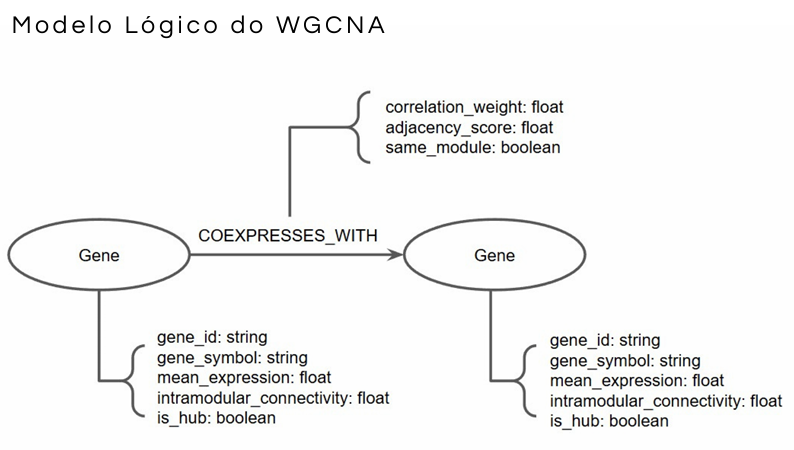
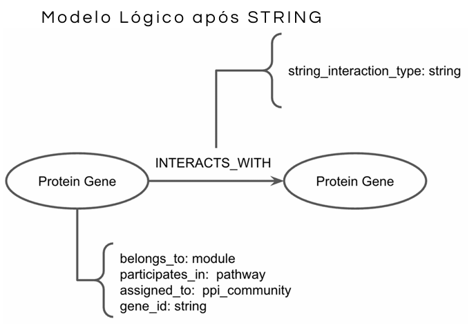

# Projeto Ciência de redes aplicada à toxicidade de microplásticos em pulmões humanos

# Project Network science applied to microplastic toxicity in human lungs

# Descrição Resumida do Projeto

A poluição por micro e nanoplásticos (MNPs) é um desafio ambiental global com impactos diretos na saúde pública devido à inalação inevitável dessas partículas, especialmente em ambientes fechados. O trato respiratório inferior é uma região aciliada e propensa ao acúmulo crônico desse material. Este projeto investiga as alterações moleculares e a toxicidade induzidas por diferentes tamanhos de partículas de poliestireno (100 nm vs 1 μm) em fibroblastos pulmonares humanos (HPFs). Utilizando técnicas de biologia computacional e ciência de redes, mapeamos a expressão gênica diferencial e a topologia de redes de coexpressão. Os resultados sugerem que as nanopartículas desencadeiam intenso estresse proteotóxico e um surpreendente mimetismo de resposta imune antiviral, enquanto as micropartículas alteram a integridade mecânica da membrana plasmática, fornecendo um modelo molecular para o desenvolvimento de fibrose pulmonar.

# Slides

- [Slides](assets/slides/apresentacao.pdf)

# Fundamentação Teórica

O acúmulo de partículas plásticas no parênquima pulmonar profundo decorre da ausência de depuração mucociliar nos bronquíolos respiratórios e alvéolos. Os fibroblastos pulmonares humanos (HPFs) são as células fundamentais na manutenção da integridade tecidual e os principais efetores no desenvolvimento de processos fibróticos. Evidências indicam que a exposição ao poliestireno induz estresse oxidativo, disfunção mitocondrial e alterações severas na síntese de proteínas. Este projeto toma como base dados transcriptômicos públicos para desvendar as cascatas de sinalização e os reguladores centrais (genes Hubs) afetados pela exposição aos MNPs.

## Artigos Base

- Chwiej et al. (2025) [Série GSE296007]: Estudo central que fornece os dados de RNA-seq de HPFs expostos a partículas de 0,1 µm e 1 µm. https://doi.org/10.1038/s41598-025-22947-7

- Sainz et al. (2024): Referência metodológica para a aplicação de WGCNA e integração com redes de interação proteína-proteína (PPI). https://doi.org/10.1186/s12870-024-05280-5

# Perguntas de Pesquisa

## Pergunta Principal

- "Como o tamanho das partículas de poliestireno (100nm vs 1μm) influencia a rede de coexpressão gênica em fibroblastos pulmonares humanos quando comparado em concentrações equivalentes, e quais módulos e hubs estão associados a respostas de estresse celular?"

## Perguntas Específicas

1. “Quais genes são diferencialmente expressos em HPFs expostos a partículas de 1μm e 100 nm em comparação ao grupo controle?”

2. “Quais módulos de coexpressão gênica se associam com tamanho de partícula e concentração?”

3. “Quais hubs aparecem como candidatos a reguladores centrais da resposta celular?”

4. “Quais processos biológicos e vias moleculares estão enriquecidos nos módulos mais associados às condições experimentais?”

O projeto respondeu a essas perguntas isolando módulos específicos de coexpressão e revelando que o nanoplástico de 100 nm em alta dose exerce silenciamento massivo de genes estruturais celulares, além de demonstrar que análises topológicas conseguem priorizar alvos terapêuticos e biomarcadores de estresse pulmonar.

# Metodologia

O pipeline biocomputacional deste projeto foi estruturado como um funil analítico projetado para converter grandes volumes de dados transcriptômicos brutos em redes biológicas interpretáveis de alta confiança. O fluxo de trabalho iniciou-se com a coleta de dados públicos de sequenciamento de RNA (RNA-Seq) obtidos do Gene Expression Omnibus (GEO), sob o código de acesso GSE296007, gerados originalmente no estudo de Chwiej et al. (2025) [Notebook 1](pipelines/notebooks/000_data_structuring.ipynb). Para garantir o foco em mecanismos regulatórios bem documentados, a matriz original passou por um processo rigoroso de anotação e filtragem em ambiente Python, onde foram selecionados exclusivamente os genes codificadores de proteínas, reduzindo o escopo inicial de mais de 63 mil transcritos para 19.520 genes alvos. Na sequência, aplicou-se uma filtragem por contagens baixas para remover ruídos experimentais e genes com baixa representação estatística entre as réplicas, consolidando uma matriz final estável de 12.176 genes para as modelagens subsequentes [Notebook 2](pipelines/notebooks/001_data_processing.ipynb).

A primeira etapa analítica consistiu na Análise de Expressão Gênica Diferencial (DEG) executada por meio do pacote PyDESeq2 [Notebook 3](pipelines/notebooks/002_deg_analysis.ipynb). O objetivo biológico desse passo foi responder de forma direta quais genes aumentaram ou diminuíram de atividade quando a célula entrou em contato com o plástico. O software ajustou modelos lineares generalizados baseados em uma distribuição binomial negativa para mapear a variação quantitativa de transcritos entre os grupos controle e as condições de exposição. Os genes diferencialmente expressos foram priorizados adotando-se um limiar de significância estatística, definido por um valor de p ajustado pelo método de Benjamini-Hochberg menor que 0,10 (Padj < 0.10) e uma magnitude de mudança biológica de pelo menos duas vezes (log2 Fold Change ≥ 1), permitindo isolar as assinaturas transcriptômicas mais impactantes do experimento.

Com a matriz tratada, procedeu-se à construção da rede de coexpressão gênica por meio do algoritmo WGCNA, implementado com o pacote PyWGCNA, seguindo a estratégia metodológica de integração entre coexpressão gênica e redes de interação proteína-proteína proposta por Sainz et al. (2024) [Notebook 4](pipelines/notebooks/003_wgcna.ipynb). Diferentemente da análise de expressão diferencial, que avalia genes individualmente por contraste experimental, o WGCNA foi utilizado como uma camada sistêmica de organização dos genes em módulos de coexpressão, isto é, grupos de genes que apresentam padrões de expressão correlacionados entre as amostras.

A rede foi construída a partir da matriz de expressão normalizada em escala logarítmica, considerando os genes previamente filtrados no pipeline de processamento. Foram utilizados os parâmetros finais `networkType = "signed hybrid"`, `TOMType = "signed"`, `minModuleSize = 20` e `MEDissThres = 0.25`. Essa configuração preserva o sinal das correlações, utiliza a matriz de sobreposição topológica para estimar similaridade entre genes e permite a formação de módulos menores, evitando a fusão excessiva de comunidades biologicamente relevantes. Com esses parâmetros, os genes foram organizados em 29 módulos de coexpressão, representados por cores.

Para relacionar os módulos aos fatores experimentais, foram calculados os module eigengenes, que resumem o perfil de expressão de cada módulo. Em seguida, esses eigengenes foram correlacionados com traços experimentais de interesse, incluindo tamanho da partícula, concentração e indicador de exposição a 100 nm. Os testes de associação módulo-traço tiveram seus valores de p corrigidos pelo método de Benjamini-Hochberg, produzindo valores de FDR ajustados. Como o conjunto de dados possui número limitado de amostras, essas associações foram interpretadas como evidência exploratória de suporte biológico, e não como critério estatístico rígido e isolado para seleção final dos módulos.

A seleção final dos genes para construção da rede não foi feita apenas pelos módulos com maiores correlações módulo-traço. Em vez disso, foi realizada uma anotação de genes [Notebook 5](pipelines/notebooks/004_gene_annotation.ipynb) e integração entre DEG e WGCNA [Notebook 6](pipelines/notebooks/005_network_export.ipynb). Primeiro, foram definidos DEGs prioritários com padj < 0.10 e |log2FoldChange| >= 1, restringindo a análise aos contrastes biologicamente mais relevantes para a hipótese do projeto. Em seguida, cada DEG prioritário foi anotado com seu respectivo módulo WGCNA. Para cada módulo, foram calculados o número de DEGs prioritários, a fração de genes do módulo representada por DEGs prioritários, os contrastes envolvidos e o suporte de associação módulo-traço. Um módulo foi selecionado apenas quando apresentava um número mínimo de DEGs prioritários e, adicionalmente, possuía pelo menos uma das seguintes evidências: associação módulo-traço exploratória (padj < 0.10 ou pval < 0.05) ou fração mínima de DEGs prioritários no módulo. Portanto, o WGCNA foi usado tanto como uma camada de contexto modular e priorização biológica, enquanto a seleção final permaneceu centrada em genes diferencialmente expressos nos contrastes de interesse, quanto como uma rede auxiliar para algumas análises exploratórias e biológicas. Essa estratégia resultou na priorização de 6 módulos WGCNA, totalizando a seleção de 601 genes diferencialmente expessos entre os 12.176 genes iniciais.

Para transformar esses agrupamentos estatísticos de coexpressão em uma malha de interação física e funcional, a lista dos 601 genes prioritários foi integrada ao banco de dados STRING (Search Tool for the Retrieval of Interacting Genes/Proteins). O STRING foi essencial para mapear quem realmente interage fisicamente com quem na prática celular. Estabeleceu-se um limiar de Alta Confiança através de um escore de corte de 0,700 (≥ 0.700), garantindo que apenas interações proteína-proteína (PPI) validadas experimentalmente ou fortemente preditas por homologia fossem mantidas, mitigando falsos-positivos na arquitetura do grafo.

Por fim, o grafo gerado foi importado para o software Cytoscape para a execução da análise topológica de redes e enriquecimento funcional ([Rede](src/network.cys)). Como redes densas assemelham-se a teias complexas de difícil interpretação visual, utilizou-se o aplicativo especializado cytoHubba para calcular a topologia e revelar os genes influenciadores do sistema. Aplicou-se o algoritmo MCC (Maximal Clique Centrality) integrado à métrica de Grau (Degree). O algoritmo MCC avalia a densidade de conexões em subgrafos altamente coesos, o que confere maior robustez biológica na identificação de reguladores centrais em comparação com métricas de centralidade tradicionais isoladas. Esse refinamento topológico permitiu filtrar e isolar visualmente os 10 e 20 genes de maior centralidade (genes Hubs). Em paralelo, os clusters desses módulos foram submetidos à plataforma Reactome para a análise de enriquecimento de vias, correlacionando os nós mais conectados do grafo com funções biológicas e rotas metabólicas humanas específicas.

## Bases de Dados

| Base de dados   | Link                                                                     | Resumo descritivo                                                                              |
| --------------- | ------------------------------------------------------------------------ | ---------------------------------------------------------------------------------------------- |
| GSE296007 (GEO) | [NCBI GEO](https://www.ncbi.nlm.nih.gov/geo/query/acc.cgi?acc=GSE296007) | Série de dados públicos de RNA-Seq de fibroblastos pulmonares humanos expostos a poliestireno. |
| STRING DB       | [STRING](https://string-db.org/)                                         | Banco de dados de interações funcionais e físicas conhecidas e preditas entre proteínas.       |
| Reactome        | [Reactome](https://reactome.org/)                                        | Base de dados de caminhos biológicos e vias metabólicas humanas.                               |

**Detalhamento e Conclusões Sobre as Bases**

- _Tratamento de Dados_: De um total de 63.241 genes iniciais da série pública, filtramos apenas os codificadores de proteína (19.520) e aplicamos redução de ruído por contagens baixas, resultando em um conjunto robusto de 12.176 genes para a modelagem.

- _Descobertas_: A análise estatística e a projeção dimensional (PCA e UMAP) evidenciaram que o perfil transcricional varia drasticamente dependendo do diâmetro e da dosagem da partícula, com as amostras de nanoplásticos em alta dose (100 nm - grupo MA100) apresentando o comportamento mais aberrante e segregado em relação ao controle.

## Modelo Lógico

O modelo lógico estruturado define entidades (Genes e Proteínas) e seus relacionamentos direcionados e ponderados (COEXPRESSES_WITH e INTERACTS_WITH), contendo atributos de conectividade intramodular e escores de adjacência.

 

## Integração entre Bases

O principal desafio de integração consistiu em alinhar os identificadores de genes transcriptômicos do ecossistema Python (PyWGCNA/MyGene) com as redes estruturais de proteínas geradas pelo STRING. Isso foi solucionado estabelecendo limiares de confiança estatística — adotando a rede de Alta Confiança (≥ 0,7) no STRING para descartar nós desconectados e focar nas interações biológicas reais. Além disso, foram realizadas transformações, filtragens e anotações nos dados de RNA-Seq brutos (obtidos no Geo) para possibilitar o mapeamento para bases como STRING e Reactome.

## Análises Realizadas

## Evolução do Projeto

O projeto original previa mapear a hierarquia regulatória da resposta ao plástico baseando-se em uma hipótese de partição simples: partículas de 100 nm afetariam a função mitocondrial, e partículas de 1 μm mudariam a membrana e a homeostase proteica. Durante a execução do pipeline, a sobreposição das redes de Alta Confiança do STRING com os dados do Reactome mudou o rumo das interpretações biológicas.

Ao contrário do esperado na proposta inicial, descobriu-se que o estresse severo de homeostase proteica (proteostase, ribossomos e transporte cotraducional) é uma assinatura exclusiva das nanopartículas de 100 nm. O nanoplástico infiltrou-se tanto no sistema que chegou a mimetizar vias de resposta imune antiviral. A hipótese sobre as partículas maiores se confirmou, demonstrando que elas agem prioritariamente no estresse mecânico e de adesão da superfície celular (membrana plasmática).

Além do mais, a metodologia evoluiu da aplicação de métricas topológicas básicas propostas originalmente (Degree e Betweenness) para o uso do algoritmo especializado cytoHubba (métrica MCC), o que permitiu filtrar com alta precisão os 20 reguladores biológicos centrais a partir de uma teia inicial complexa.

# Ferramentas

- Jupyter Notebooks: Base para implementação do workflow de processamento, limpeza de dados e uso de pacotes transcriptômicos (PyDESeq2, PyWGCNA)

- Pandas/Numpy: Bibliotecas Python usadas para manipulação de dados

- Plotly: Biblioteca Python para geração de gráficos estatísticos interativos

- MyGene: Biblioteca Python para enriquecimento de informações dos genes

- PyDESeq2: Biblioteca Python para análise de expressão gênica diferencial

- PyWGCNA: Biblioteca Python utilizada para construção de redes ponderadas de coexpressão gênica, identificação de módulos de genes coexpressos e associação exploratória desses módulos com traços experimentais por meio de module eigengenes.

- STRING DB: Geração da malha inicial de interações moleculares

- Reactome: Banco de dados de Pathways

- Cytoscape & cytoHubba: Essenciais para a análise de redes, renderização visual, cálculo de propriedades topológicas e isolamento de nós centrais

# Resultados

A análise de expressão gênica diferencial (DEA) executada via PyDESeq2 revelou que o perfil transcricional dos fibroblastos pulmonares humanos (HPFs) varia de acordo com o diâmetro e com a dosagem da partícula de poliestireno utilizada, corroborando os achados preliminares de mapeamento global de Chwiej et al. (2025). Na resposta biológica aos nanoplásticos (100nm), observou-se que o grupo exposto à alta concentração (MA100, 0,1 g/L) concentrou a maior fração dos genes diferencialmente expressos (DEGs), exibindo uma resposta celular altamente intensa, enquanto as doses média (MB100) e baixa (MC100) demonstraram um impacto baixo e muito baixo, respectivamente. 

<!-- v -->

Por outro lado, a resposta molecular aos microplásticos (1μm) evidenciou um comportamento não-linear marcante, no qual a dose intermediária (MD1, 0,05 g/L) e a dose mais baixa (MC1, 0,001 g/L) foram as responsáveis por desencadear uma quantidade proeminente e elevada de DEGs, contrastando com os efeitos moderados e baixos provocados pelas doses alta (MA1) e média (MB1). No nível estrutural da rede, os genes que se destacaram como diferencialmente expressos e que formaram sub-redes físicas consolidadas (especialmente isoladas no contraste entre MC100 e MC1) compreenderam um bloco de proteínas estruturais ribossomais — incluindo RPS15A, RPL7, RPS23, RPS26, RPL31, RPL26, RPL3, RPS25, RPL12, RPL35, RPS27, RPSA, RPS3A, RPS3 e RPS2 —, além de fatores de elongação da tradução (EEF1A1), proteínas de transporte cotraducional (SRP9 e SRP19) e glicoproteínas estruturais de adesão celular de membrana, como a E-caderina (CDH1).

Mecanisticamente, essa divergência transcricional fundamenta-se no fato de que as nanopartículas de 100nm conseguem translocar passivamente através das membranas das organelas e acumular-se no ambiente intracelular. Como demonstrado por Mazzone et al. (2025), essa infiltração interfere diretamente na proteostase e na síntese proteica basal, gerando uma assinatura citotóxica severa em dosagens elevadas. Em contrapartida, os microplásticos de 1μm exercem estresse por contato físico prolongado e distorção mecânica da membrana plasmática. Conforme evidenciado por Pinto et al. (2021), essa pressão física induz alterações morfológicas e funcionais proeminentes mesmo em doses baixas bem dispersas (MC1), antes que ocorra a aglomeração física das partículas em concentrações maiores.

<!-- w -->

A modelagem de redes de coexpressão via WGCNA agrupou os 12.117 genes filtrados do sistema em 14 módulos funcionais. Embora nenhum módulo isolado tenha cruzado o limiar de significância formal após a aplicação da rigorosa penalidade de Benjamini-Hochberg, os p-valores identificados (p ~ 0,01 - 0,02) revelaram correlações de Pearson (r) altamente responsivas às condições experimentais. O maior componente da rede estrutural, representado pelo módulo darkgrey (contendo 4.103 genes), correlacionou-se positivamente com as partículas maiores de microplástico (r = +0,50), indicando ser o bloco molecular ativado para lidar com estresses mecânicos externos.
Inversamente, os nanoplásticos demonstraram uma associação oposta no módulo darkred, correlacionando-se negativamente com o tamanho da partícula (r = -0,53). Sob cenários de estresse por alta concentração, o módulo red revelou uma forte correlação negativa (r = -0,67) especificamente com o grupo de dose alta de nanopartículas (MA100), evidenciando um silenciamento massivo e coordenado de vias celulares essenciais sob cenários de toxicidade celular severa.

A sobreposição dessas comunidades de coexpressão às tabelas de centralidade geradas no Cytoscape permitiu isolar os caminhos biológicos a partir de propriedades topológicas específicas da rede de interações. Os reguladores categorizados como Hubs por Grau (Degree - TOP 10/20) revelaram ser predominantemente chaperonas de estresse celular (HSPs) e fatores de transcrição associados a complexos de sinalização de dano, atuando na propagação em cascata das ordens de sobrevivência celular downstream. Já os reguladores refinados por Centralidade MCC (Maximal Clique Centrality) isolaram com alta confiança o cluster de genes RPL/RPS, o fator EEF1A1 e o complexo SRP9/SRP19, os quais funcionam restabelecer o equilíbrio das proteínas danificadas pela agressão do plástico. Fora do eixo traducional, a identificação do hub periférico da E-caderina (CDH1) revelou sua importância como um sensor de integridade tecidual. De acordo com Li et al. (2024), a desregulação crônica da caderina atua como um biomarcador clássico do início de transições fenotípicas e ativação fibrótica em fibroblastos.

<!-- teia -->

A integração desses dados estatísticos e topológicos aos bancos Reactome e KEGG traduziu a arquitetura das redes em mecanismos fisiopatológicos, onde o cenário de Estresse Traducional e Bioenergético, associado ao módulo darkred e à exposição aos nanoplásticos, exibiu um forte enriquecimento para as vias hsa03010: Ribosome e hsa03060: Protein export no KEGG, bem como para os caminhos de SRP-dependent cotranslational protein targeting to membrane e Eukaryotic Translation Elongation no Reactome. Esses achados corroboram a tese de Mazzone et al. (2025) de que o acúmulo interno das partículas de 100nm gera um estado de estresse proteotóxico agudo, forçando o retículo endoplasmático e os ribossomos a operarem em regime de sobrecarga para mitigar o desdobramento incorreto de proteínas.

Em contrapartida, as vias de Mecanotransdução e Remodelação de Superfície, associadas ao módulo darkgrey e aos microplásticos, apresentaram enriquecimento para processos de integridade estrutural e ancoragem, tais como hsa04520: Adherens junction e hsa04514: Cell adhesion molecules (CAMs). Esse resultado reflete a resposta física direta descrita por Pinto et al. (2021) sobre a pressão mecânica exercida pelas partículas de 1μm contra a membrana plasmática, desencadeando a reorganização dos filamentos de actina do citoesqueleto e vias de endocitose ou fagocitose frustrada.

Globalmente, assume-se que o silenciamento metabólico observado no módulo red sob estresse, combinado ao estresse mecânico crônico evidenciado nas vias de adesão celular, atua como o ponto de inflexão transcricional para o desfecho crônico da patologia. Conforme o modelo experimental de exposição intratraqueal proposto por Li et al. (2024), a agressão contínua por poliestireno estimula a transdiferenciação patológica de HPFs saudáveis em miofibroblastos contráteis através da sinalização de vias de remodelamento. Uma vez ativados, esses miofibroblastos passam a secretar componentes da matriz extracelular de forma descontrolada, promovendo a deposição excessiva de colágeno, a cicatrização crônica e a perda de complacência do parênquima pulmonar distal, culminando em fibrose pulmonar progressiva.

# Discussão

### Influência do tamanho da partícula nos mecanismos celulares

Os resultados obtidos revelam que o diâmetro das partículas poliméricas atua como o principal divisor das rotas de toxicidade molecular. Verificou-se que as micropartículas de maior diâmetro (1μm) correlacionam-se majoritariamente com respostas físicas de superfície, evidenciadas pelo enriquecimento de vias de remodelamento estrutural e adesão celular (módulo darkgrey). Esse comportamento indica a ocorrência de estresse mecânico na membrana plasmática dos fibroblastos, forçando uma reorganização adaptativa do citoesqueleto.

Em contrapartida, as nanopartículas (100 nm) demonstraram capacidade de transpor barreiras físicas externas e interagir intimamente com o maquinário subcelular interno. A exposição ao nanoplástico induziu um profundo desligamento coordenado de processos homeostáticos (módulo red) e uma sobrecarga na tradução e exportação de proteínas, afetando o complexo cotraducional SRP9/SRP19 e proteínas estruturais dos ribossomos (RPL/RPS). Esse fenômeno explicita que as nanopartículas penetram no citoplasma celular, gerando um estresse proteotóxico intracelular direto e agudo que não é observado nas exposições às micropartículas.

### O efeito sistêmico e o mimetismo viral

O achado biológico mais expressivo do projeto reside no enriquecimento de vias do Reactome voltadas à tradução de mRNA viral e resposta a infecções por Influenza e SARS-CoV nas células submetidas ao nanoplástico. Do ponto de vista fisiopatológico, esse resultado indica uma correlação de mimetismo imune. Os fibroblastos HPFs não sofrem uma invasão de patógenos biológicos, mas o estresse proteotóxico e bioenergético crônico provocado pelo acúmulo de partículas de 100 nm é tão disruptivo que desencadeia alarmes celulares universais.

A célula interpreta a falha massiva em seu processamento de proteínas e o estresse do retículo endoplasmático como se estivesse sob um ataque de replicação viral ativa, disparando vias inflamatórias inespecíficas e agudas. Esse estado inflamatório mimetizado crônico no parênquima pulmonar profundo, onde não há o clearance mucociliar para remover as nanopartículas, gera um microambiente citotóxico contínuo, perpetuando o recrutamento de citocinas inflamatórias sem que o agente estressor original possa ser eliminado.

### Implicações fisiopatológicas

Em uma perspectiva macrobiológica, as análises integradas de Ciência de Redes permitiram transitar de uma descrição isolada de genes alterados para a decodificação de uma assinatura sistêmica da toxicidade plástica no tecido respiratório. O modelo integrado demonstra que os MNPs exercem um ataque em dupla frente aos fibroblastos pulmonares humanos: os microplásticos geram danos mecânicos de membrana e os nanoplásticos destroem a proteostase interna da célula.

Ademais, o elo clínico desse processo é o papel do fibroblasto na arquitetura pulmonar. O estado inflamatório decorrente do mimetismo viral aliado ao estresse mecânico crônico atua como um gatilho biológico contínuo que estimula a transição fenotípica estável de fibroblastos em miofibroblastos hiperativos. Uma vez consolidados, esses miofibroblastos passam a secretar componentes de matriz extracelular (como o colágeno) de maneira desregulada e persistente, culminando na perda de complacência pulmonar, destruição alveolar e, em última instância, no desenvolvimento de quadros irreversíveis de fibrose pulmonar.

# Conclusão

O desenvolvimento deste projeto permitiu consolidar a evidência computacional de que a toxicidade induzida pelo poliestireno em fibroblastos pulmonares humanos é estritamente dependente do diâmetro das partículas expostas. Restou estatisticamente comprovado, por meio do mapeamento de perfis transcricionais divergentes, que as partículas de nanoplásticos causam o maior impacto no sistema biológico. Esse impacto foi evidenciado por um silenciamento gênico massivo no módulo red e por uma severa sobrecarga no maquinário celular de tradução e exportação de proteínas, afetando o complexo SRP9/SRP19 e proteínas ribossomais. Em contrapartida, a análise de redes confirmou que as micropartículas limitam sua atuação a alterações físicas na integridade estrutural e nas vias de adesão da superfície da membrana celular. Complementarmente, teoriza-se que a convergência crônica entre a disfunção traducional e a deformação mecânica de superfície atue como o gatilho molecular para impulsionar a transição fenotípica estável de fibroblastos em miofibroblastos hiperativos.

# Trabalhos Futuros

- Expandir as análises para incluir componentes do transcriptoma não-codificadores de proteínas (como lncRNAs e miRNAs).

- Realizar ensaios biológicos in vitro para validação experimental dos principais alvos e biomarcadores Hubs revelados pela análise computacional.

# Referências Bibliográficas

- Chwiej, J., et al. (2025). _Study on the respiratory toxicity of 0.1 µm and 1 µm polystyrene particles in human lung fibroblasts_. Gene Expression Omnibus, GSE296007. Disponível em: https://doi.org/10.1038/s41598-025-22947-7

- Sainz, M., et al. (2024). _Application of Weighted Gene Co-expression Network Analysis (WGCNA) and Protein-Protein Interaction networks_. BMC Plant Biology. Disponível em: https://doi.org/10.1186/s12870-024-05280-5

- Langfelder, P., & Horvath, S. (2008). _WGCNA: an R package for weighted correlation network analysis_. BMC Bioinformatics, 9(1), 559.

- Love, M. I., Huber, W., & Anders, S. (2014). _Moderated estimation of fold change and dispersion for RNA-seq data with DESeq2_. Genome Biology, 15(12), 550.

- National Center for Biotechnology Information (NCBI). _Sequence Read Archive (SRA), Accession PRJNA868178_.
